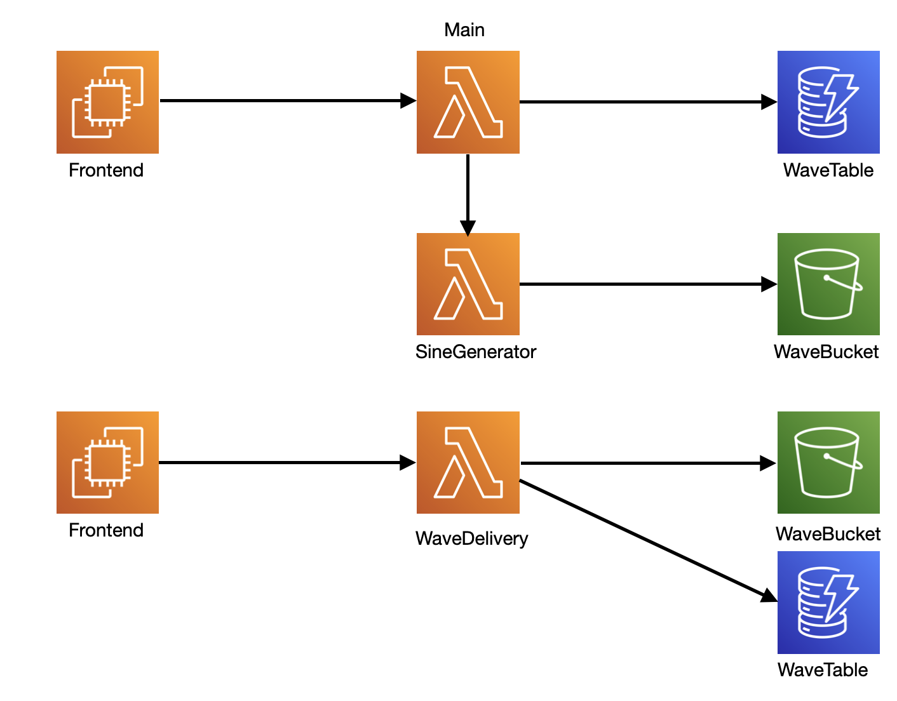
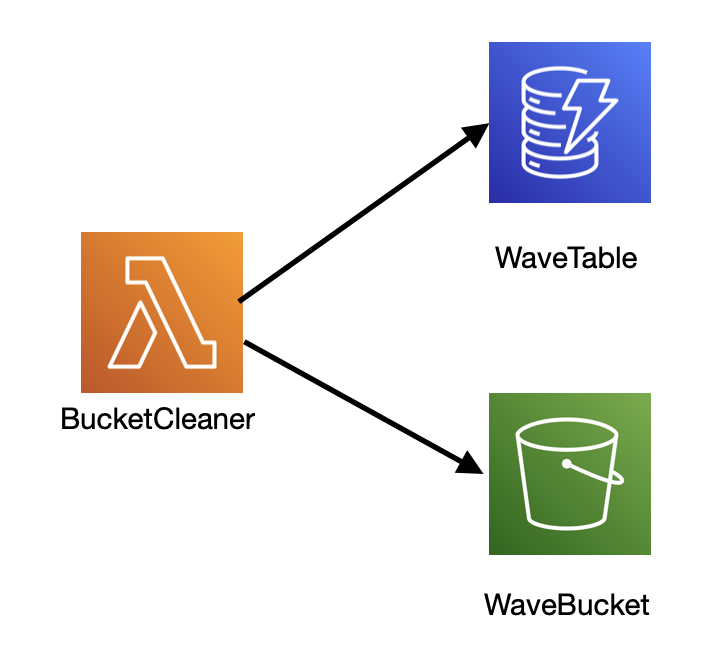

# Project for Software Development for Cloud Computing

## Description

A cloud application, in which a user can specify a set of parameters to create a wav file containing sine waves of different frequencies, which then can be downloaded on his/her computer.

# Specification

## ENV-Variables for Deployment

- TF_VAR_TABLE_NAME: Name of Table Name in DynamoDB, containing info on requests and wav files
- TF_VAR_GLOBAL_INDEX: Name of Global Index in DynamoDB
- TF_VAR_BUCKET_NAME: Name of Bucket storing all wav files
- TF_VAR_GENERATOR_LAMBDA: Name of Lambda function which generates the actual wav file
- TF_VAR_CLEANER_LAMBDA: Name of Lambda which cleans old/downloaded files from bucket
- TF_VAR_MAIN_LAMBDA: Name of Main Lambda, which gets invoked by frontend

## General 

The Application consists of several lambda functions, a frontend, a NoSQL Database and an S3 bucket. The main flow of the application is as follows:



First, the `Frontend` makes a request to the `Main` lambda function. The request specifies the parameters of the Wave file, which should be created. A detailed description of the parameters is listed below.

The `Main` lambda then creates puts an item into the `WaveTable` DynamoDB and invokes the `SineGenerator` lambda, which creates the file. Note, that the `Main` lambda doesn't wait for the file to be complete, but returns immediately, with the `file_id` and `request_id`.

The `SineGenerator` lambda creates the file, and stores it in the `WaveBucket` S3 bucket.

After `Main` returns to `Frontend`, `Frontend` makes a request containing the `file_id` to the `WaveDelivery` lambda, which checks periodically if the file is in the bucket. After it is found, it returns the file to the frontend and marks the entry corresponding to the file as downloaded.

The `WaveBucket` gets cleaned periodically:



Here, a `BucketCleaner` lambda gets triggered once a day, and checks the `WaveTable` for files that have been downloaded during the day. Afterwards, it deletes the files from the `WaveBucket`.
It also deletes all files in the `WaveBucket` that are older than a set amount of days.

## Components (short descriptions)

### Lambdas

#### Main

Gets invoked by `Frontend` to start creation of wav file.
[More info](cloud_main_lambda/Readme.md).

#### SineGenerator

Gets invoked by [Main](cloud_main_lambda/Readme.md). Creates wav file.
[More info](cloud_sine_generator/Readme.md).

#### BucketCleaner

Gets Invoked once a day. Deletes old and downloaded files from [WaveBucket](#wavebucket).
[More info](cloud_bucket_cleaner/Readme.md).

#### WaveDeliveryService

Gets invoked by [Frontend](link). Checks in [WaveBucket](#wavebucket) if a file is ready and sends it back to the client. 
[More info](link).

### Frontend

#### S3 Bucket

Is accessible via this link: http://cloud-react-website-bucket.s3-website.eu-central-1.amazonaws.com/
A user can specify certain parameters for a wav fail and wait for it to download.

### Storage

#### WaveBucket

This Bucket holds all the files that are created by the [SineGenerator](#sinegenerator) lambda. It gets cleaned once a day by the [BucketCleaner](#bucketcleaner) lambda.

#### WaveTable

Contains items about each request and respective file.

An item has the following structure:

```
{
    id: String,             // partition key
    date: String,           // insert date
    time: String,           // insert time
    request_id: String      // original request
    is_downloaded: bool,    // duh
    specs: Object,          // contents of wav file
}
```
A detailed description of specs can be found [here](sine_generator/readme.md#dataformat).

The WaveTable contains a Global Secondary index, with the index's partition key referring to the `date` attribute and it's sort key referring to the `time` attribute. It also contains the `is_downloaded` attribute as an additional field.
The index is used in order to query for items that have been created on a certain day.

